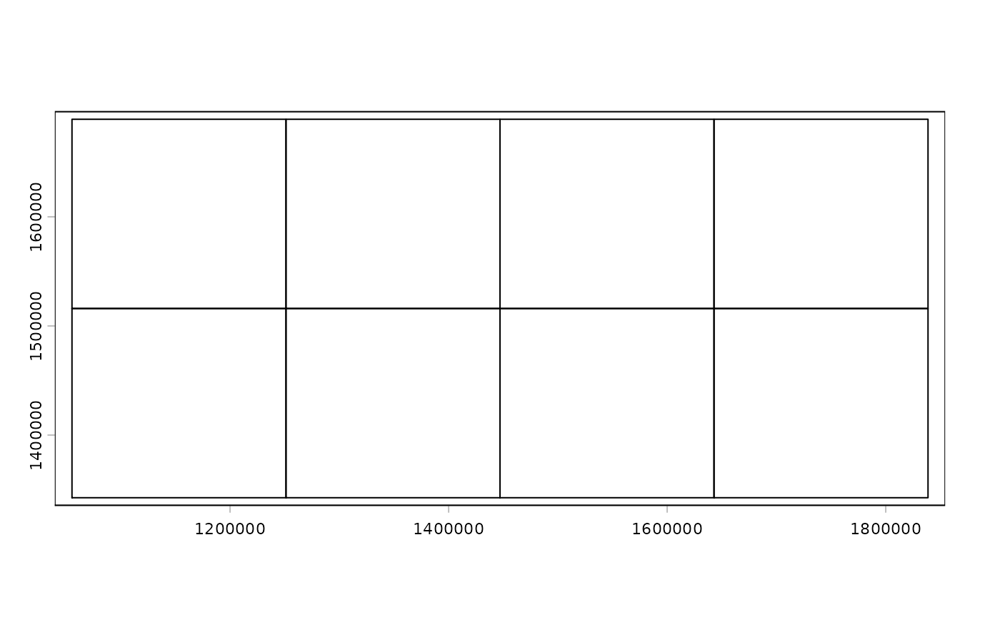
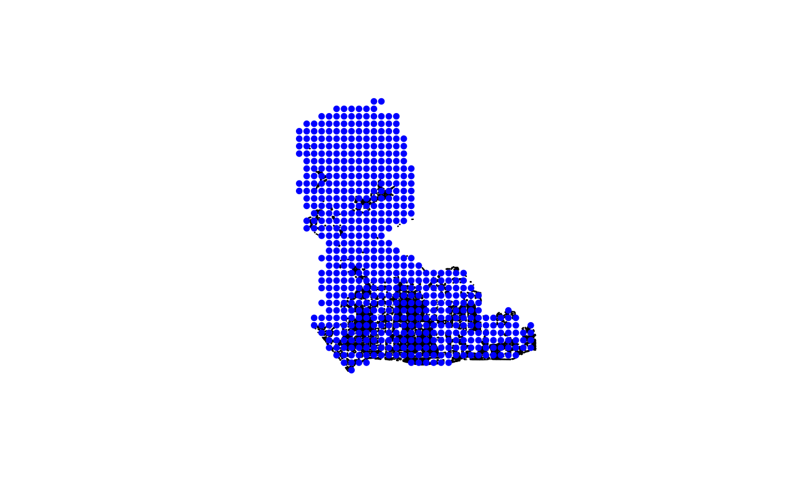

# Getting started with chopin

## Introduction

- `chopin` automatically distributes geospatial data computation over
  multiple threads.
- Function centered workflow will streamline the process of
  parallelizing geospatial computation with minimal effort.

## `chopin` workflow

- The simplest way of parallelizing generic geospatial computation is to
  start from `par_pad_*` functions to `par_grid`, or running
  `par_hierarchy`, or `par_multirasters` functions at once.

``` r

library(chopin)
library(terra)
library(sf)
library(collapse)
library(dplyr)
library(future)
library(future.mirai)
library(future.apply)
```

## Example data

- North Carolinian counties and a raster of elevation data are used as
  example data.

``` r

temp_dir <- tempdir(check = TRUE)

url_nccnty <-
  paste0(
    "https://raw.githubusercontent.com/",
    "ropensci/chopin/refs/heads/main/",
    "tests/testdata/nc_hierarchy.gpkg"
  )
url_ncelev <-
  paste0(
    "https://raw.githubusercontent.com/",
    "ropensci/chopin/refs/heads/main/",
    "tests/testdata/nc_srtm15_otm.tif"
  )

nccnty_path <- file.path(temp_dir, "nc_hierarchy.gpkg")
ncelev_path <- file.path(temp_dir, "nc_srtm15_otm.tif")

# download data
download.file(url_nccnty, nccnty_path, mode = "wb", quiet = TRUE)
download.file(url_ncelev, ncelev_path, mode = "wb", quiet = TRUE)

nccnty <- terra::vect(nccnty_path, layer = "county")
ncelev <- terra::rast(ncelev_path)
```

### Generating random points in North Carolina

- To demonstrate chopin functions, we generate 10,000 random points in
  North Carolina

``` r

ncsamp <-
  terra::spatSample(
    nccnty,
    1e4L
  )
ncsamp$pid <- seq_len(nrow(ncsamp))
```

## Creating grids

- The example below will generate a regular grid from the random point
  data.

``` r

ncgrid <- par_pad_grid(ncsamp, mode = "grid", nx = 4L, ny = 2L, padding = 10000)

plot(ncgrid$original)
```



## Extracting values from raster

- Since all `par_*` functions operate on `future` backends, users should
  define the future plan before running the functions. `multicore` plan
  supports `terra` objects which may lead to faster computation, but it
  is not supported in Windows. An alternative is `future.mirai`’s
  `mirai_multisession` plan, which is supported in many platforms and
  generally faster than plain future multisession plan.
- `workers` argument should be defined with an integer value to specify
  the number of threads to be used.

``` r

future::plan(future.mirai::mirai_multisession, workers = 2L)
```

- Then we dispatch multiple `extract_at` runs on the grid polygons.
- Before we proceed, the terra object should be converted to sf object.

``` r

pg <-
  par_grid(
    grids = ncgrid,
    pad_y = FALSE,
    .debug = TRUE,
    fun_dist = extract_at,
    x = ncelev_path,
    y = sf::st_as_sf(ncsamp),
    id = "pid",
    radius = 1e4,
    func = "mean"
  )
```

``` r

# also possible in mirai with par_*_mirai functions
# mirai daemons should be created first
mirai::daemons(n = 2L)
pg <-
  par_grid_mirai(
    grids = ncgrid,
    pad_y = FALSE,
    .debug = TRUE,
    fun_dist = extract_at,
    x = ncelev_path,
    y = sf::st_as_sf(ncsamp),
    id = "pid",
    radius = 1e4,
    func = "mean"
  )
mirai::daemons(n = 0L)
```

## Hierarchical processing

- Here we demonstrate hierarchical processing of the random points using
  census tract polygons.

``` r

nccnty <- sf::st_read(nccnty_path, layer = "county")
```

    ## Reading layer `county' from data source `/tmp/RtmpAlSvKa/nc_hierarchy.gpkg' using driver `GPKG'
    ## Simple feature collection with 100 features and 1 field
    ## Geometry type: POLYGON
    ## Dimension:     XY
    ## Bounding box:  xmin: 1054155 ymin: 1341756 xmax: 1838923 ymax: 1690176
    ## Projected CRS: NAD83 / Conus Albers

``` r

nctrct <- sf::st_read(nccnty_path, layer = "tracts")
```

    ## Reading layer `tracts' from data source `/tmp/RtmpAlSvKa/nc_hierarchy.gpkg' using driver `GPKG'
    ## Simple feature collection with 2672 features and 1 field
    ## Geometry type: MULTIPOLYGON
    ## Dimension:     XY
    ## Bounding box:  xmin: 1054155 ymin: 1341756 xmax: 1838923 ymax: 1690176
    ## Projected CRS: NAD83 / Conus Albers

- The example below will parallelize summarizing mean elevation at 10
  kilometers circular buffers of random sample points by the first five
  characters of census tract unique identifiers, which are county codes.
- This example demonstrates the hierarchy can be defined from any given
  polygons if the unique identifiers are suitably formatted for defining
  the hierarchy.

``` r

px <-
  par_hierarchy(
    # from here the par_hierarchy-specific arguments
    regions = nctrct,
    regions_id = "GEOID",
    length_left = 5,
    pad = 10000,
    pad_y = FALSE,
    .debug = TRUE,
    # from here are the dispatched function definition
    # for parallel workers
    fun_dist = extract_at,
    # below should follow the arguments of the dispatched function
    x = ncelev,
    y = sf::st_as_sf(ncsamp),
    id = "pid",
    radius = 1e4,
    func = "mean"
  )

dim(px)
```

    ## [1] 10000     2

``` r

head(px)
```

    ##   pid      mean
    ## 1  79 13.664886
    ## 2 198  7.980108
    ## 3 337 12.189816
    ## 4 454  2.763836
    ## 5 467 19.170189
    ## 6 485 13.523435

``` r

tail(px)
```

    ##        pid      mean
    ## 9995  9542 -1.184563
    ## 9996  9703  5.548240
    ## 9997  9756  5.548804
    ## 9998  9759  6.540437
    ## 9999  9841  6.414054
    ## 10000 9963  4.990165

## Multiraster processing

- Here we demonstrate multiraster processing of the random points using
  multiple rasters.

``` r

ncelev <- terra::rast(ncelev_path)
tdir <- tempdir(check = TRUE)
terra::writeRaster(ncelev, file.path(tdir, "test1.tif"), overwrite = TRUE)
terra::writeRaster(ncelev, file.path(tdir, "test2.tif"), overwrite = TRUE)
terra::writeRaster(ncelev, file.path(tdir, "test3.tif"), overwrite = TRUE)
terra::writeRaster(ncelev, file.path(tdir, "test4.tif"), overwrite = TRUE)
terra::writeRaster(ncelev, file.path(tdir, "test5.tif"), overwrite = TRUE)

rasts <- list.files(tdir, pattern = "tif$", full.names = TRUE)

pm <-
  par_multirasters(
    filenames = rasts,
    fun_dist = extract_at,
    x = NA,
    y = sf::st_as_sf(ncsamp)[1:500, ],
    id = "pid",
    radius = 1e4,
    func = "mean",
    .debug = TRUE
  )

dim(pm)
```

    ## [1] 3000    2

``` r

head(pm)
```

    ##          mean                       base_raster
    ## 1   12.443567 /tmp/RtmpAlSvKa/nc_srtm15_otm.tif
    ## 2   74.934341 /tmp/RtmpAlSvKa/nc_srtm15_otm.tif
    ## 3  179.088806 /tmp/RtmpAlSvKa/nc_srtm15_otm.tif
    ## 4    8.542515 /tmp/RtmpAlSvKa/nc_srtm15_otm.tif
    ## 5 1087.089722 /tmp/RtmpAlSvKa/nc_srtm15_otm.tif
    ## 6  110.032043 /tmp/RtmpAlSvKa/nc_srtm15_otm.tif

``` r

tail(pm)
```

    ##            mean               base_raster
    ## 2995 101.370438 /tmp/RtmpAlSvKa/test5.tif
    ## 2996  -2.881788 /tmp/RtmpAlSvKa/test5.tif
    ## 2997   7.347102 /tmp/RtmpAlSvKa/test5.tif
    ## 2998   8.790645 /tmp/RtmpAlSvKa/test5.tif
    ## 2999  21.443277 /tmp/RtmpAlSvKa/test5.tif
    ## 3000  56.097313 /tmp/RtmpAlSvKa/test5.tif

## User-defined functions

From version 0.9.9, a custom function that takes `sf` objects in `x` and
`y` arguments can be used with `par_grid` and `par_hierarchy` functions.
The custom function should return a data.frame or tibble object.

An example below demonstrates to compute the floor area ratio (or
area-enclosed ratio, AER) in 100 meters circular buffers of points from
random points in central Seoul, South Korea.

``` r

gpkg_path <- system.file("extdata/osm_seoul.gpkg", package = "chopin")
bldg <- sf::st_read(gpkg_path, layer = "buildings")
```

    ## Reading layer `buildings' from data source 
    ##   `/github/home/R/x86_64-pc-linux-gnu-library/4.6/chopin/extdata/osm_seoul.gpkg' 
    ##   using driver `GPKG'
    ## Simple feature collection with 11112 features and 2 fields
    ## Geometry type: POLYGON
    ## Dimension:     XY
    ## Bounding box:  xmin: 319332.8 ymin: 4159652 xmax: 325432.1 ymax: 4166901
    ## Projected CRS: WGS 84 / UTM zone 52N

``` r

grdpnt <- sf::st_read(gpkg_path, layer = "points")
```

    ## Reading layer `points' from data source 
    ##   `/github/home/R/x86_64-pc-linux-gnu-library/4.6/chopin/extdata/osm_seoul.gpkg' 
    ##   using driver `GPKG'
    ## Simple feature collection with 595 features and 1 field
    ## Geometry type: POINT
    ## Dimension:     XY
    ## Bounding box:  xmin: 319096.8 ymin: 4159684 xmax: 325296.8 ymax: 4166884
    ## Projected CRS: WGS 84 / UTM zone 52N

``` r

# plot
plot(sf::st_geometry(bldg), col = "lightgrey")
plot(sf::st_geometry(grdpnt), add = TRUE, pch = 20, col = "blue")
```



``` r

# Radius for AER (meters)
radius_m <- 100

# This function will be dispatched in parallel over computational grids.
aer_at_points <-
  function(
    x, y,
    radius,
    id_col = "pid",
    floors_col = "floors",
    area_col = "foot_m2"
  ) {
    if (!inherits(x, "sf") && !inherits(y, "sf")) {
      x <- sf::st_as_sf(x)
      y <- sf::st_as_sf(y)
    }
    yorig <- y
    y <- sf::st_geometry(y)

    # Buffers around each point
    buf <- sf::st_buffer(y, radius)
    # spatial join (buildings intersecting buffers)
    j <- sf::st_intersects(buf, sf::st_geometry(x))
    # Compute
    out <- vapply(seq_along(j), function(i) {
      if (length(j[[i]]) == 0) return(NA_real_)
      sub <- x[j[[i]], ]
      sub <- sub[!is.na(sub[[floors_col]]) & !is.na(sub[[area_col]]), ]
      if (nrow(sub) == 0) return(NA_real_)
      aer_num <- sum(sub[[area_col]] * sub[[floors_col]], na.rm = TRUE)
      aer_den <- pi * radius^2
      aer_num / aer_den
    }, numeric(1))

    res <-
      data.frame(
        pid = yorig[[id_col]],
        aer = out
      )
    res
  }

## Parallel processing
# Initiate mirai damons
plan(mirai_multisession, workers = 4L)
grd <- chopin::par_pad_grid(
  bldg,
  mode = "grid",
  nx = 1L,
  ny = 4L,
  padding = 300
)

bldg_cast <- sf::st_cast(bldg, "POLYGON")
radius_m <- 300

res <- par_grid_mirai(
  grids    = grd,
  fun_dist = aer_at_points,
  x        = bldg_cast,
  y        = grdpnt,
  radius   = radius_m,
  id_col = "pid",
  .debug = TRUE
)
future::plan(future::sequential)
mirai::daemons(n = 0L)

head(res)
```

    ##   pid       aer
    ## 1   1 0.2847932
    ## 2   2 0.7716681
    ## 3   3 0.4084137
    ## 4   4 0.4438036
    ## 5   5 0.6123537
    ## 6   6 0.5815721

## Caveats

### Why parallelization is slower than the ordinary function run?

- Parallelization may underperform when the datasets are too small to
  take advantage of divide-and-compute approach, where parallelization
  overhead is involved. Overhead here refers to the required amount of
  computational resources for transferring objects to multiple
  processes.
- Since the demonstrations above use quite small datasets, the advantage
  of parallelization was not as noticeable as it was expected. Should a
  large amount of data (spatial/temporal resolution or number of files,
  for example) be processed, users could find the efficiency of this
  package. A vignette in this package demonstrates use cases extracting
  various climate/weather datasets.

### Notes on data restrictions

`chopin` works best with **two-dimensional** (**planar**) geometries.
Users should disable `s2` spherical geometry mode in `sf` by setting
`sf::sf_use_s2(FALSE)`. Running any `chopin` functions at spherical or
three-dimensional (e.g., including M/Z dimensions) geometries may
produce incorrect or unexpected results.
