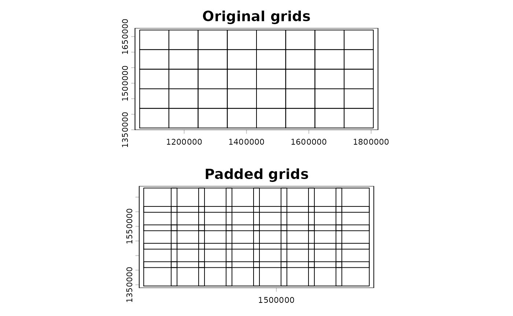
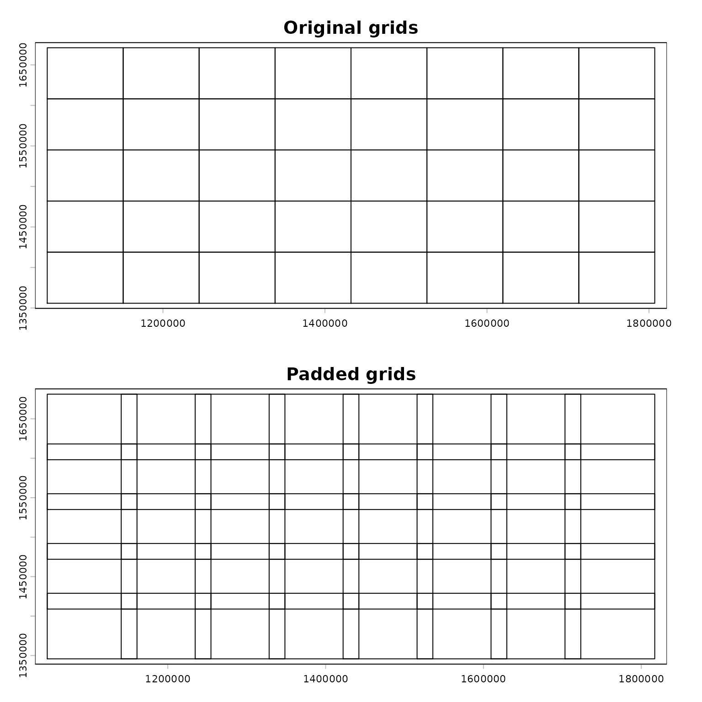
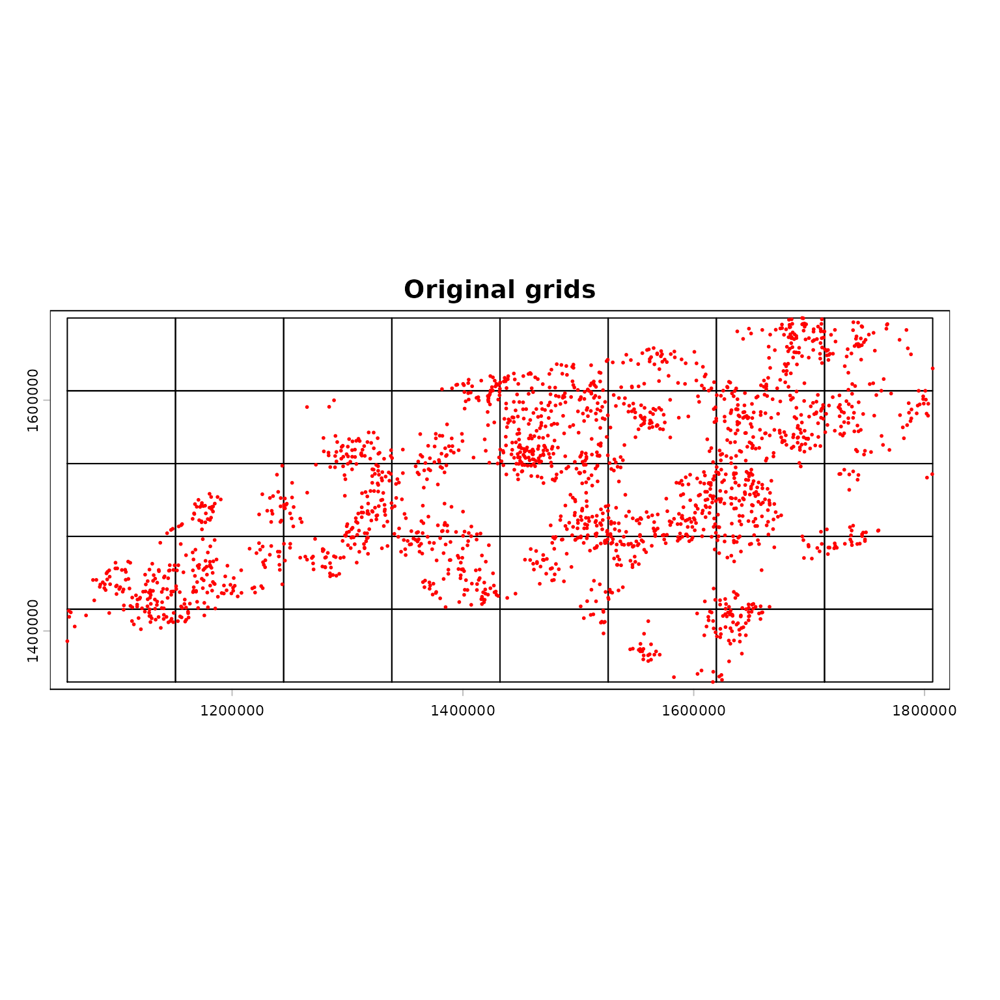
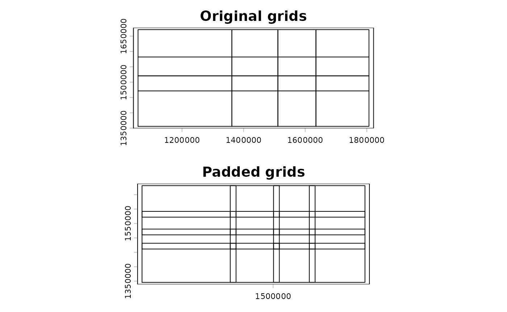
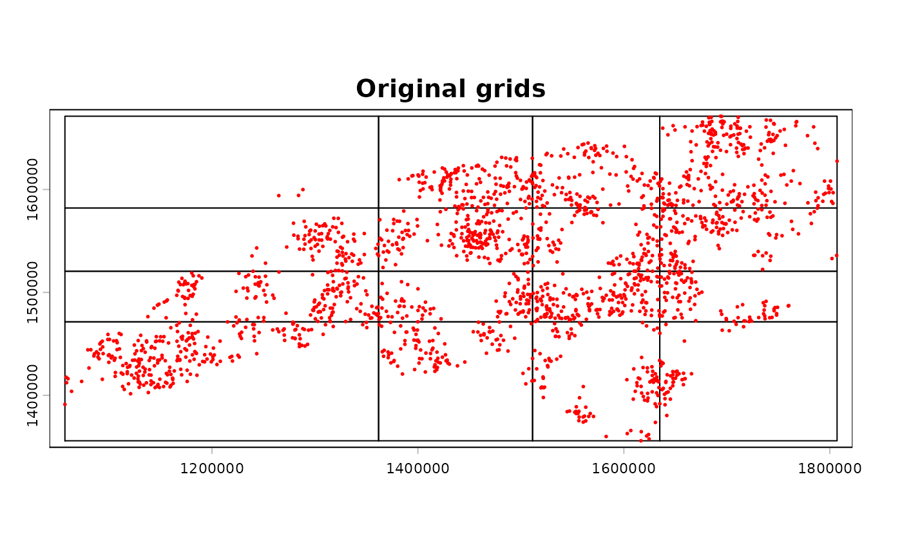
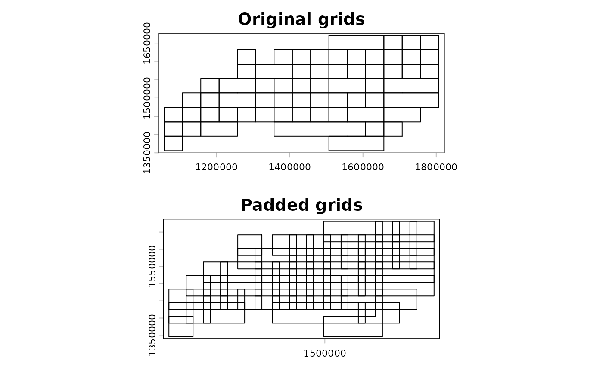
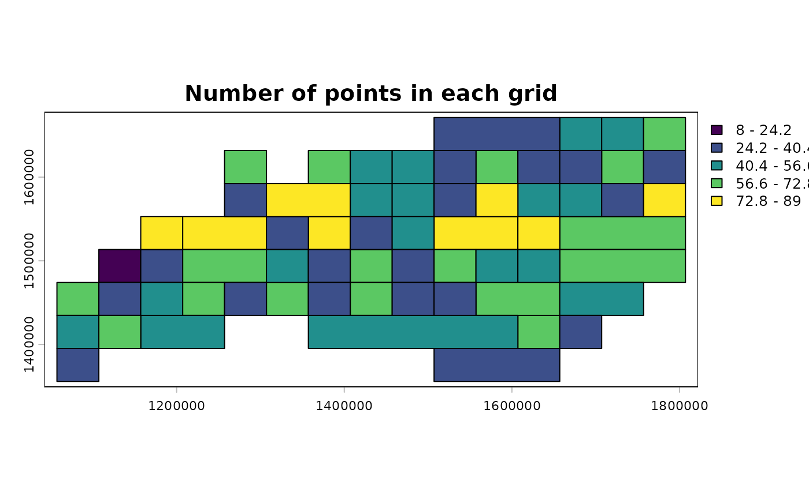
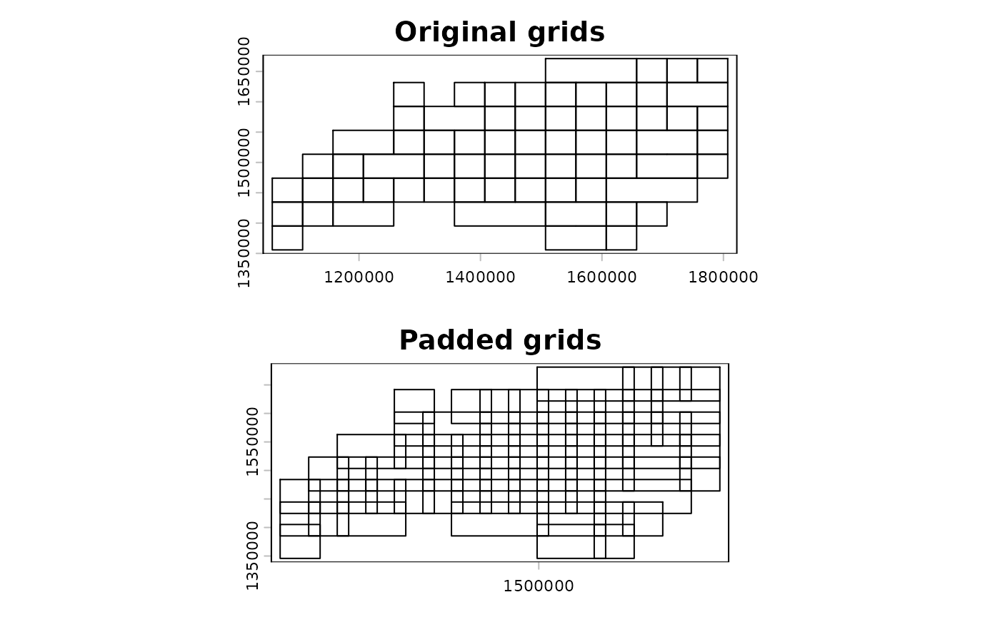
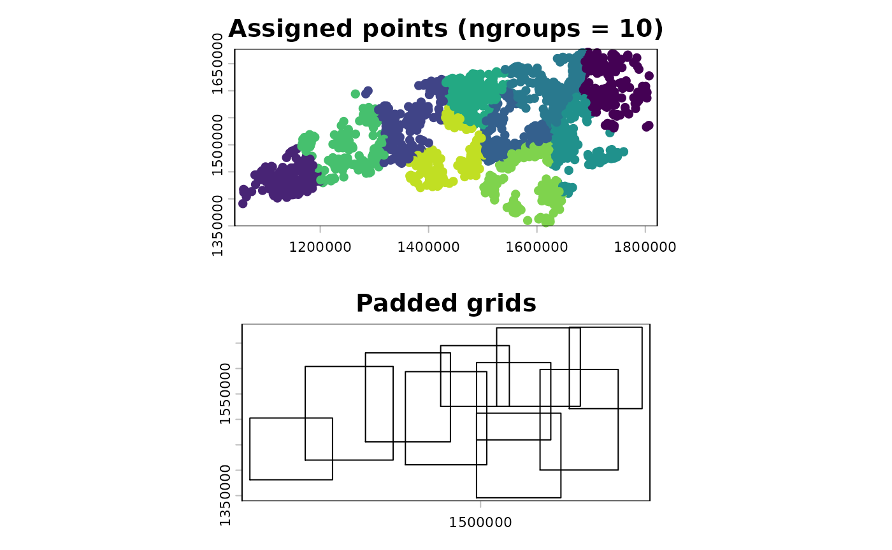

# Generate computational grids

``` r

library(chopin)
library(dplyr)
```

    ## 
    ## Attaching package: 'dplyr'

    ## The following objects are masked from 'package:stats':
    ## 
    ##     filter, lag

    ## The following objects are masked from 'package:base':
    ## 
    ##     intersect, setdiff, setequal, union

``` r

library(sf)
```

    ## Linking to GEOS 3.12.1, GDAL 3.8.4, PROJ 9.4.0; sf_use_s2() is TRUE

``` r

library(terra)
```

    ## terra 1.9.34

``` r

library(anticlust)
library(igraph)
```

    ## 
    ## Attaching package: 'igraph'

    ## The following objects are masked from 'package:terra':
    ## 
    ##     blocks, compare, union

    ## The following objects are masked from 'package:dplyr':
    ## 
    ##     as_data_frame, groups, union

    ## The following objects are masked from 'package:stats':
    ## 
    ##     decompose, spectrum

    ## The following object is masked from 'package:base':
    ## 
    ##     union

``` r

library(future)
```

    ## 
    ## Attaching package: 'future'

    ## The following objects are masked from 'package:igraph':
    ## 
    ##     %->%, %<-%

``` r

library(future.mirai)
library(h3r)
```

    ## Loading required package: h3lib

    ## 
    ## Attaching package: 'h3r'

    ## The following object is masked from 'package:terra':
    ## 
    ##     gridDistance

``` r

library(dggridR)

# old par
lastpar <- par(mfrow = c(1, 1))
options(sf_use_s2 = FALSE)
```

## Computational grids

- Computational grids refer to a set of polygons that cover the entire
  spatial domain of interest. These grids are used to split the spatial
  domain into smaller pieces for parallel processing.
- `chopin` provides functions to generate computational grids for
  parallel processing by
  [`par_grid()`](https://docs.ropensci.org/chopin/reference/par_grid.md)
  function.
- The standard sequence of running
  [`par_grid()`](https://docs.ropensci.org/chopin/reference/par_grid.md)
  includes the following steps:
  1.  Generate computational grids with
      [`par_pad_grid()`](https://docs.ropensci.org/chopin/reference/par_pad_grid.md)
      or
      [`par_pad_balanced()`](https://docs.ropensci.org/chopin/reference/par_pad_balanced.md).
      This step will give you a set of grid polygons, one of which is
      original splits and the other is padded in consideration of buffer
      radius in the subsequent spatial operations.
  2.  Run
      [`par_grid()`](https://docs.ropensci.org/chopin/reference/par_grid.md)
      with the input dataset and the grid polygons.
- Before advancing, we define terms for clarity.
  - **Input data**: the data where the computed value will be stored.
    For example, when extracting raster values with vector objects,
    vector objects are the input data.
  - **Target data**: the data *from* which the values come. In the
    example above, raster object is the target data.
- Original and padded grids will be used to split the main input with
  the original grid and the target dataset for computation with the
  padded grid, respectively.

## Types of computational grids and their generation

- There are two approaches to generate computational grids. One is to
  use
  [`par_pad_grid()`](https://docs.ropensci.org/chopin/reference/par_pad_grid.md)
  with one of three `mode`s and the other is to use `par_group_grid()`.
  Thus, users have **four options** in total to generate computational
  grids.
- `padding` argument is very important to ensure the accurate parallel
  operations in a case where buffering is involved. Suppose a user has
  point geometry inputs and apply circular buffer with a certain radius.
  Since the original grid (without padding = no overlap between adjacent
  grids) filters the original input in each parallel worker, points near
  each grid border may miss target data as buffered polygons exceed the
  grid.

### `par_pad_grid()`: standard interface

- [`par_pad_grid()`](https://docs.ropensci.org/chopin/reference/par_pad_grid.md)
  generates regular grid polygons with padding for parallel processing.
  Padding is the distance of overlapping between grid polygons,
  essentially from the buffer radius of the points when buffer polygons
  are concerned.
- [`par_pad_grid()`](https://docs.ropensci.org/chopin/reference/par_pad_grid.md)
  supports three internal `mode`s:
  - `mode = "grid"`: generates regular grid polygons with padding, `nx`
    and `ny` arguments determine the number of columns and rows in the
    grid, respectively.
  - `mode = "grid_quantile"`: generates regular grid polygons with
    padding based on quantiles of the number of points in each grid. The
    grids will look irregular and the points per grid will be more
    balanced than the `grid` mode.
  - `mode = "grid_advanced"`: generates regular grid polygons with
    padding based on the number of points in each grid and the number of
    points in the entire dataset. `nx` and `ny` arguments determine the
    number of columns and rows in the grid, then `merge_max` argument
    controls how many adjacent grids are merged into one grid.
    `grid_min_features` argument determines the minimum number of points
    in each grid, which means grids with fewer points than this value
    will be merged with adjacent grids. Adjusting these arguments can
    balance the computational load among the threads and reduce the
    overhead of parallelization.

### `par_pad_balanced()`: focusing on getting the balanced clusters

- [`par_pad_balanced()`](https://docs.ropensci.org/chopin/reference/par_pad_balanced.md)
  groups the inputs into equal size, then generates padded rectangles
  that cover the same number of points per grid. Users can use the
  output of this function into
  [`par_grid()`](https://docs.ropensci.org/chopin/reference/par_grid.md)
  for parallel processing.

### Random points in NC

- For demonstration of
  [`par_pad_grid()`](https://docs.ropensci.org/chopin/reference/par_pad_grid.md),
  we use moderately clustered point locations generated inside the
  counties of North Carolina.

``` r

ncpoly <- system.file("shape/nc.shp", package = "sf")
ncsf <- sf::read_sf(ncpoly)
ncsf <- sf::st_transform(ncsf, "EPSG:5070")
plot(sf::st_geometry(ncsf))
```


``` r

# sampling clustered point
library(spatstat.random)
```

    ## Loading required package: spatstat.data

    ## Loading required package: spatstat.univar

    ## spatstat.univar 3.2-0

    ## Loading required package: spatstat.geom

    ## spatstat.geom 3.8-2

    ## 
    ## Attaching package: 'spatstat.geom'

    ## The following objects are masked from 'package:igraph':
    ## 
    ##     diameter, edges, is.connected, vertices

    ## The following objects are masked from 'package:terra':
    ## 
    ##     area, delaunay, is.empty, rescale, rotate, shift, where.max,
    ##     where.min

    ## spatstat.random 3.5-1

``` r

set.seed(202404)
ncpoints <-
  sf::st_sample(
    x = ncsf,
    type = "Thomas",
    mu = 20,
    scale = 1e4,
    kappa = 1.25e-9
  )
ncpoints <- ncpoints[seq_len(2e3L), ]

ncpoints <- sf::st_as_sf(ncpoints)
ncpoints <- sf::st_set_crs(ncpoints, "EPSG:5070")
ncpoints$pid <- sprintf("PID-%05d", seq(1, nrow(ncpoints)))
plot(sf::st_geometry(ncpoints))
```


``` r

# convert to terra SpatVector
ncpoints_tr <- terra::vect(ncpoints)
```

## Visualize computational grids

- The output of
  [`par_pad_grid()`](https://docs.ropensci.org/chopin/reference/par_pad_grid.md)
  and
  [`par_pad_balanced()`](https://docs.ropensci.org/chopin/reference/par_pad_balanced.md)
  is length 2 list. A significant difference between the two is the
  first element of the output. In
  [`par_pad_grid()`](https://docs.ropensci.org/chopin/reference/par_pad_grid.md),
  it is always a sf or SpatVector object with polygon geometries. On the
  other hand,
  [`par_pad_balanced()`](https://docs.ropensci.org/chopin/reference/par_pad_balanced.md)
  will have the first element as a sf or SpatVector object with the same
  geometry type as the original input. For example, it will have point
  geometries if the input was point.

``` r

compregions <-
  chopin::par_pad_grid(
    ncpoints_tr,
    mode = "grid",
    nx = 8L,
    ny = 5L,
    padding = 1e4L
  )

# a list object
class(compregions)
```

    ## [1] "list"

``` r

# length of 2
names(compregions)
```

    ## [1] "original" "padded"

``` r

par(mfrow = c(2, 1))
plot(compregions$original, main = "Original grids")
plot(compregions$padded, main = "Padded grids")
```



### Generate regular grid computational regions

- [`chopin::par_pad_grid()`](https://docs.ropensci.org/chopin/reference/par_pad_grid.md)
  takes a spatial dataset to generate regular grid polygons with `nx`
  and `ny` arguments with padding. Users will have both overlapping (by
  the degree of `radius`) and non-overlapping grids, both of which will
  be utilized to split locations and target datasets into sub-datasets
  for efficient processing.

``` r

compregions <-
  chopin::par_pad_grid(
    ncpoints_tr,
    mode = "grid",
    nx = 8L,
    ny = 5L,
    padding = 1e4L
  )
```

- The output of
  [`par_pad_grid()`](https://docs.ropensci.org/chopin/reference/par_pad_grid.md)
  is a list object with two elements named `original` (non-overlapping
  grid polygons) and `padded` (overlapping by `padding`). The class of
  each element depends on the input dataset class. The figures below
  illustrate the grid polygons with and without overlaps.

``` r

names(compregions)
```

    ## [1] "original" "padded"

``` r

oldpar <- par()
par(mfrow = c(2, 1))
terra::plot(compregions$original, main = "Original grids")
terra::plot(compregions$padded, main = "Padded grids")
```



``` r

par(mfrow = c(1, 1))
terra::plot(compregions$original, main = "Original grids")
terra::plot(ncpoints_tr, add = TRUE, col = "red", cex = 0.4)
```



### Split the points by two 1D quantiles

- `mode = "grid_quantile"` generates regular grid polygons with padding
  based on quantiles of the coordinates in each dimension.
- When using this mode, users should define `quantiles` argument, which
  will be used to get the same number of quantiles in each dimension. A
  convenient way to define [`seq()`](https://rdrr.io/r/base/seq.html)
  function with `length.out` argument. The example below uses
  `length.out = 5`, which will give quartiles.

``` r

grid_quantiles <-
  chopin::par_pad_grid(
    input = ncpoints_tr,
    mode = "grid_quantile",
    quantiles = seq(0, 1, length.out = 5),
    padding = 1e4L
  )

names(grid_quantiles)
```

    ## [1] "original" "padded"

``` r

par(mfrow = c(2, 1))
terra::plot(grid_quantiles$original, main = "Original grids")
terra::plot(grid_quantiles$padded, main = "Padded grids")
```



``` r

par(mfrow = c(1, 1))
terra::plot(grid_quantiles$original, main = "Original grids")
terra::plot(ncpoints_tr, add = TRUE, col = "red", cex = 0.4)
```



### Merge the grids based on the number of points

- `mode = "grid_advanced"` utilizes finer grids to merge the results
  from the finer grids into the coarser grids. This behavior can balance
  the computational load among the threads and reduce the overhead of
  parallelization. That said, this mode internally generates grids in
  `mode = "grid"` and merges them based on the number of points in each
  grid.
- To determine the adjacency and merging behavior, minimum spanning tree
  (MST) is identified. The function utilizes
  [`igraph::mst()`](https://r.igraph.org/reference/mst.html) for MST
  identification and other graph summary functions under the hood.
- As a note, users can adjust the merging behavior by changing the
  arguments `grid_min_features` and `merge_max`.

``` r

grid_advanced1 <-
  chopin::par_pad_grid(
    input = ncpoints_tr,
    mode = "grid_advanced",
    nx = 15L,
    ny = 8L,
    padding = 1e4L,
    grid_min_features = 25L,
    merge_max = 5L
  )
```

    ## Switch terra class to sf...
    ## Switch terra class to sf...
    ## ℹ The merged polygons have too complex shapes.
    ## Increase threshold or use the original grids.
    ## 
    ## Switch sf class to terra...

``` r

par(mfrow = c(2, 1))
terra::plot(grid_advanced1$original, main = "Original grids")
terra::plot(grid_advanced1$padded, main = "Padded grids")
```



``` r

par(mfrow = c(1, 1))
terra::plot(grid_advanced1$original, main = "Merged grids (merge_max = 5)")
terra::plot(ncpoints_tr, add = TRUE, col = "red", cex = 0.4)
```


``` r

ncpoints_tr$n <- 1
n_points <-
  terra::zonal(
    ncpoints_tr,
    grid_advanced1$original,
    fun = "sum"
  )[["n"]]

grid_advanced1g <- grid_advanced1$original
grid_advanced1g$n_points <- n_points

terra::plot(grid_advanced1g, "n_points", main = "Number of points in each grid")
```



#### Different values in `merge_max`

- Keeping other arguments the same, we can see the difference in the
  number of merged grids by changing the `merge_max` argument.

``` r

grid_advanced2 <-
  chopin::par_pad_grid(
    input = ncpoints_tr,
    mode = "grid_advanced",
    nx = 15L,
    ny = 8L,
    padding = 1e4L,
    grid_min_features = 30L,
    merge_max = 4L
  )
```

    ## Switch terra class to sf...
    ## Switch terra class to sf...
    ## ℹ The merged polygons have too complex shapes.
    ## Increase threshold or use the original grids.
    ## 
    ## Switch sf class to terra...

``` r

par(mfrow = c(2, 1))
terra::plot(grid_advanced2$original, main = "Original grids")
terra::plot(grid_advanced2$padded, main = "Padded grids")
```


``` r

par(mfrow = c(1, 1))
terra::plot(grid_advanced2$original, main = "Merged grids (merge_max = 8)")
terra::plot(ncpoints_tr, add = TRUE, col = "red", cex = 0.4)
```


``` r

grid_advanced3 <-
  chopin::par_pad_grid(
    input = ncpoints_tr,
    mode = "grid_advanced",
    nx = 15L,
    ny = 8L,
    padding = 1e4L,
    grid_min_features = 25L,
    merge_max = 3L
  )
```

    ## Switch terra class to sf...
    ## Switch terra class to sf...
    ## ℹ The merged polygons have too complex shapes.
    ## Increase threshold or use the original grids.
    ## 
    ## Switch sf class to terra...

``` r

par(mfrow = c(2, 1))
terra::plot(grid_advanced3$original, main = "Original grids")
terra::plot(grid_advanced3$padded, main = "Padded grids")
```



``` r

par(mfrow = c(1, 1))
terra::plot(grid_advanced3$original, main = "Merged grids (merge_max = 3)")
terra::plot(ncpoints_tr, add = TRUE, col = "red", cex = 0.4)
```


#### `par_make_balanced()`

- [`par_make_balanced()`](https://docs.ropensci.org/chopin/reference/par_make_balanced.md)
  uses `anticlust` package to split the point set into the balanced
  clusters.
  - In the background,
    [`par_pad_balanced()`](https://docs.ropensci.org/chopin/reference/par_pad_balanced.md)
    is run first to generate the equally sized clusters from the input.
    Then, padding is applied to the extent of each cluster to be
    compatible with
    [`par_grid()`](https://docs.ropensci.org/chopin/reference/par_grid.md),
    where both the original and the padded grids are used.
  - Please note that `ngroups` argument value must be the **exact**
    divisor of the number of points. For example, in the example below,
    when one changes `ngroups` to `10L`, it will fail as the number of
    points is not divisible by 10.
  - Consult the
    [`anticlust`](https://CRAN.R-project.org/package=anticlust) package
    for more details on the algorithm.
- [`par_pad_balanced()`](https://docs.ropensci.org/chopin/reference/par_pad_balanced.md)
  makes a compatible object to the output of
  [`par_pad_grid()`](https://docs.ropensci.org/chopin/reference/par_pad_grid.md)
  directly from the input points.
- As illustrated in the figure below, the points will be split into
  `ngroups` clusters with the same number of points then processed in
  parallel by using the output object with
  [`par_grid()`](https://docs.ropensci.org/chopin/reference/par_grid.md).

``` r

# ngroups should be the exact divisor of the number of points!
group_bal_grid <-
  chopin::par_pad_balanced(
    points_in = ncpoints_tr,
    ngroups = 10L,
    padding = 1e4
  )
group_bal_grid$original$CGRIDID <- as.factor(group_bal_grid$original$CGRIDID)

par(mfrow = c(2, 1))
terra::plot(group_bal_grid$original, "CGRIDID",
            legend = FALSE,
            main = "Assigned points (ngroups = 10)")
terra::plot(group_bal_grid$padded, main = "Padded grids")
```



``` r

# revert to the original par
par(lastpar)
```

### Common grid systems

- Without need to generate grids, users can use the common grid systems
  such as H3 and DGG grids. These grids are generated by
  [`par_pad_grid()`](https://docs.ropensci.org/chopin/reference/par_pad_grid.md)
  with `mode = "h3"` and `mode = "dggrid"`, respectively. They only need
  to specify the resolution of the grid and the padding distance. Both
  grid systems provide the exhaustive grids that cover the entire
  spatial domain of interest at the specified resolution.

``` r

if (rlang::is_installed("h3r")) {
  suppressWarnings(
    nc_comp_region_h3 <-
      par_pad_grid(
        ncpoints_tr,
        mode = "h3",
        res = 4L,
        padding = 10000
      )
  )
  par(mfcol = c(1, 2))
  plot(nc_comp_region_h3$original$geometry, main = "H3 grid (lv.4)")
  plot(nc_comp_region_h3$padded$geometry, main = "H3 padded grid (lv.4)")
  par(lastpar)

}
```

    ## Input sf object should be in WGS84 (EPSG:4326) CRS.
    ## Non-polygon geometries detected. Attempt to convert to polygons using concave
    ## hull.
    ## although coordinates are longitude/latitude, st_union assumes that they are
    ## planar
    ## 
    ## although coordinates are longitude/latitude, st_intersects assumes that they
    ## are planar
    ## 
    ## Switch sf class to terra...
    ## Switch terra class to sf...


``` r

if (rlang::is_installed("dggridR")) {
  nc_comp_region_dggrid <-
    par_pad_grid(
      ncpoints_tr,
      mode = "dggrid",
      res = 7L,
      padding = 10000
    )
  par(mfcol = c(1, 2))
  plot(nc_comp_region_dggrid$original$geometry, main = "DGGRID (lv.7)")
  plot(nc_comp_region_dggrid$padded$geometry, main = "Padded DGGRID (lv.7)")
  par(lastpar)

}
```

    ## Input sf object should be in WGS84 (EPSG:4326) CRS.
    ## Switch sf class to terra...
    ## Switch terra class to sf...


